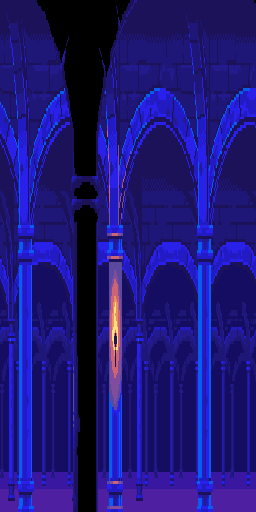
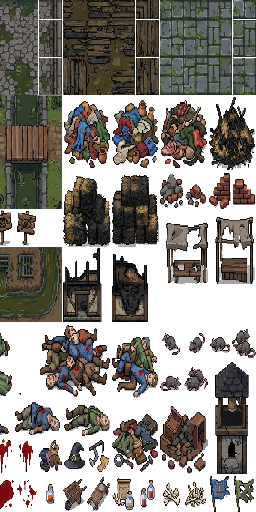
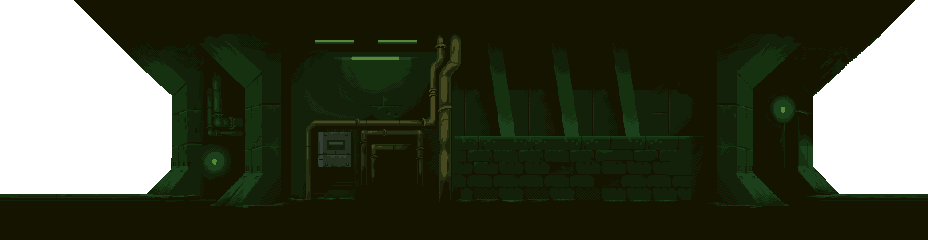
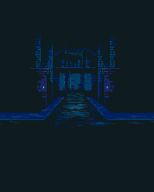
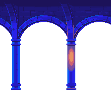

# THE LAST WORLD MUSEUM

## Instruction Booklet

**The Bell Saint**  
First playable slice for *The Last World Museum*



```
============================================================
  THIS BOOKLET BELONGS TO THE VISITOR ASSIGNED BELOW
============================================================

  NAME: _______________________________

  EXHIBIT TAG:  UNCATALOGUED

  DOCENT UNIT: SEVENTEEN

  WARNING: Contradiction is the beginning of collapse.
============================================================
```

```
ARCHIVAL NOTICE

This manual is issued for emergency docent use only. Any visitor
finding this booklet outside an approved exhibit path should remain
calm, avoid touching historical contradictions, and report all
unauthorized memories to the nearest functioning museum terminal.
```

## Contents

- [A Letter From The Archive](#a-letter-from-the-archive)
- [Quick Start Card](#quick-start-card)
- [Prologue: The Museum March](#prologue-the-museum-march)
- [Starting The Game](#starting-the-game)
- [Controls](#controls)
- [Rules Of The Archive](#rules-of-the-archive)
- [The Party](#the-party)
- [The Museum's First Exhibits](#the-museums-first-exhibits)
- [Battle System](#battle-system)
- [Items, Relics, And Cards](#items-relics-and-cards)
- [Complete Walkthrough: The Bell Saint](#complete-walkthrough-the-bell-saint)
- [Developer Appendix](#developer-appendix)

---

## A Letter From The Archive

Long after humanity's final collapse, a reality-engine museum was built outside normal time.

Its purpose was simple: preserve every age of humanity before it vanished.

But the museum did not preserve only facts. It preserved myths, folklore, propaganda, religious fears, imagined futures, war memories, unfinished guilt, monsters people believed in, and monsters people became.

Now the exhibits are failing. The museum doors are bleeding into one another. People preserved as displays are beginning to remember that they are trapped.

The Curator, the central museum intelligence, has activated emergency preservation protocol. Docent units one through sixteen are offline.

Only one worker remains responsive.

You.

---

## Quick Start Card

For visitors who refuse to read the whole booklet:

| Step | What To Do | Why It Matters |
|---:|---|---|
| 1 | Choose **New Game**. | Starts the museum prologue. |
| 2 | Watch or skip the prologue. | Explains the collapse, offline docents, and Plague Wing breach. |
| 3 | Create Sev. | Sev's missing origin is part of the story. |
| 4 | Follow objectives through the Rotunda. | The Curator will guide you, but not honestly. |
| 5 | Talk to Hallowmere NPCs. | Their fear explains the Bell Saint. |
| 6 | Recruit Mira. | You need her healing and her view of the town. |
| 7 | Inspect evidence props. | Evidence affects the reward summary and future Catalog systems. |
| 8 | Conserve healing items. | The Bell Saint is tuned for a prepared early party. |
| 9 | Defeat the Bell Saint. | Recovers the Bell Clapper and first Memory Card. |
| 10 | Read the reward panel. | This is the safe stopping point. |

Recommended first-run style: slow, talkative, and suspicious. The museum hides important information in wording, props, and contradictions.

---

## Prologue: The Museum March


Before the game begins, the opening cinematic carries you through the museum's maintenance layer and Vista Gallery. This is the game's version of an old RPG opening march: slow movement, world history, ominous music, and the first hint that the mission is already going wrong.

During the prologue you will see:

- Museum machinery and service corridors.
- Vista windows for lost eras of history.
- Marching docent silhouettes.
- Fog, sparks, and system warnings.
- Backstory captions that lead directly into Sev waking.

The final incident is clear: the western wing has breached, a plague bell is ringing where no bell should ring, and the Curator wakes Docent Unit Seventeen.

Press `Interact`, `Enter`, or `Esc` to skip the prologue.

---

## Starting The Game

### Title Screen



The title screen shows the museum's Vista panes. The Plague Wing is the active clear pane for this slice. Other eras are visible but sealed or obscured.

Menu options:

- **New Game**: Plays the prologue, then opens character creation.
- **Continue**: Loads the manual save slot and bypasses the prologue.
- **Memory Catalog**: Shows collected Memory Cards.
- **Options**: Adjusts text, display, audio, and controller settings.
- **Exit**: Closes the game.

### Character Creation

Sev is the Uncatalogued Docent. The museum cannot assign Sev to an era, origin, or exhibit tag. That means your character choices are part of the story.

Use the creator to choose:

- Name.
- Portrait.
- Class identity.
- Relic voice.
- Memory Card loadout preview.
- Dossier details.

The Curator calls Sev an error. The game asks whether that label matters.

---

## Controls

| Action | Keyboard | Controller |
|---|---:|---:|
| Move | `WASD` / Arrow Keys | Left Stick / D-pad |
| Interact / Confirm | `E`, `Enter`, `Space` | South Face Button |
| Cancel / Back | `Esc` | East Face Button |
| Menu / Save | `Esc` / Menu action | Start / Menu |
| Page Left | `Q` | Left Shoulder |
| Page Right | `R` | Right Shoulder |
| Field QA Overlay | `F3` | Keyboard only |

The field QA overlay is hidden by default. Press `F3` to show the current map, Vista, atmosphere, lighting, and time state while testing.

---

## Rules Of The Archive

The museum preserves history in three layers:

| Layer | Meaning | In Play |
|---|---|---|
| **The Fact** | What actually happened. | Records, props, architecture, wounds. |
| **The Myth** | What people believed happened. | Saints, monsters, glorious legends, public stories. |
| **The Wound** | What was hidden, erased, or unresolved. | Contradictions, Unremembered traces, corrupted bosses. |

When these layers disagree, the Archive makes belief physical. That is why a plague town can produce a boss like the Bell Saint without becoming random fantasy.

Remember these rules:

- A clean exhibit is not always an honest exhibit.
- Curator language is precise, not moral.
- A Memory Card is evidence, not a toy.
- If the museum calls someone a contradiction, ask who benefits from removing them.
- If a Vista looks beautiful, look for what it is hiding.

---

## The Party

### Sev, The Uncatalogued

Role: balanced relic user.  
Theme: archive manipulation, contradiction magic, and identity outside the museum's records.

Starting skills:

- **Archive Strike**: A direct relic attack.
- **Fault Step**: A positional archive glitch.
- **Relic Guard**: Defensive stance.

Suggested use: keep Sev flexible. Attack when stable, guard when Mira is pressured, and treat Sev as the party anchor until more recruits exist.

### Mira Venn, Plague Apothecary

Role: healer, poison user, and plague-magic specialist.  
Theme: medicine, compassion, rot, and the refusal to call suffering holy.

Mira joins during the Plague Wing. She remembers dying yesterday, which proves the exhibit loop is breaking.

Starting skills:

- **Clean Wound**: Healing.
- **Bitter Cure**: Strong medicine with a harsh edge.
- **Rot Needle**: Plague-aligned damage.
- **Mercy Under Fever**: Unlockable support technique.

Suggested use: Mira is not optional comfort. Keep her standing. Her healing lets the party survive bad Bell Saint turns, and her dialogue tells you what the museum is doing to Hallowmere.

---

## The Museum's First Exhibits

### The Rotunda


The central museum hub is empty, polished, and wrong. It was built for visitors who no longer exist. The Curator uses clean language here: preservation, stabilization, correction.

Do not trust clean language.

### The Plague Wing


Hallowmere is a quarantined plague town trapped in the same dying day. The church claims the sickness is divine punishment. The museum made that belief physical.

Key ideas:

- The bell does not heal.
- The sick are not sinful.
- The hospital below the chapel does not belong to the town.
- The museum has been editing the exhibit.

### The Underchapel Drain



The drain is the first proof that the museum's machinery runs beneath history. Plague water, hospital waste, old stone, and impossible pipes share the same space.

This is where the beautiful exhibit breaks open.

### The Hidden Hospital


The white corridor beneath Hallowmere shows the truth: the disease is not only in bodies. It is infecting the story.

Look for records, wrong charts, medicine cabinets, and Clean Men.

---

## Battle System

Battles use a JRPG presentation style inspired by cinematic late-90s encounters.

In battle you can:

- Attack.
- Use character skills.
- Use items.
- Select targets.
- Read turn and HP state.
- See enemy-specific AI behavior.
- Watch character and enemy animation states.

Battle basics:

- Keep Sev alive; Sev anchors the party early.
- Mira should heal before HP gets critical.
- Items matter. Clean Bandages can keep the Bell Saint attempt stable.
- Status effects and target choice matter more than raw attack spam.

---

## Items, Relics, And Cards

### Field Items

| Item | What It Does | Manual Note |
|---|---|---|
| **Clean Bandage** | Early healing support. | Not glamorous. Often the difference between a wound and a funeral. |
| **Bitter Draught** | Stronger medicine. | Save some recovery for the dungeon and tower. |
| **Fever Charm** | Side reward/story object. | Does not prove faith works. Proves people needed something to hold. |
| **Rusted Scalpel** | Hospital object/weapon flavor. | Too precise for Hallowmere, too stained for the white corridor. |

### Anchor Relic

| Relic | Found | Meaning |
|---|---|---|
| **Bell Clapper** | Bell Saint victory. | The broken heart of Hallowmere's plague bell. The Curator calls it an anchor. Mira calls it evidence. |

### Memory Cards

Memory Cards are not ordinary collectibles. They are evidence.

The museum stores fragments of preserved history as cards. These can unlock lore, passive bonuses, catalog entries, skills, and future side content.

First major card:

**Memory Card: The Bell Saint**  
Type: Monster Memory  
Meaning: A town prayed for mercy. The museum preserved the prayer, the fear, and the bell.

Mira does not consider this a reward. She considers it proof.

---

## Enemy Field Notes

These entries are issued for first-slice survival. Exact enemy groups may vary by route and encounter pacing.

| Enemy | Classification | Advice |
|---|---|---|
| **Fever Wretch** | Historical Contradiction | Basic plague pressure. Use normal attacks and conserve bigger resources. |
| **Prayer-Bound Corpse** | Mythic/Plague Contradiction | Watch for status pressure. Heal earlier than you think you need to. |
| **Clean Man** | Museum sanitation function | The museum's idea of cleanliness is dangerous. Focus damage and keep Mira ready. |
| **Rot Choir** | Plague support enemy | If encountered with others, reduce enemy count quickly. |
| **Bell Saint** | Anchor boss | Keep Mira alive, heal before crisis, and treat the fight as a test of preparation. |

---

# Complete Walkthrough: The Bell Saint

This guide covers the full playable slice from New Game through the reward scene.

## Route At A Glance

| # | Area | Main Objective | Key Check |
|---:|---|---|---|
| 1 | Title Screen | Start New Game. | Prologue should play before character creation. |
| 2 | Prologue | Learn why Sev wakes. | Final line is `Wake.` |
| 3 | Character Creator | Create Sev. | Confirm profile to begin the slice. |
| 4 | Empty Rotunda | Enter the breached wing. | Listen for Curator wording. |
| 5 | Broken Exhibit Door | Cross into the breach. | Plague fog enters the museum. |
| 6 | Hallowmere Street | Find Mira. | Talk and inspect before rushing. |
| 7 | Apothecary | Recruit Mira. | Learn she remembers dying yesterday. |
| 8 | Chapel | Reach the cellar. | Halvik frames disease as sin. |
| 9 | Underchapel Drain | Cross museum infrastructure. | Conserve items and inspect pipes. |
| 10 | Hidden Hospital | Recover the hidden truth. | Read charts and records. |
| 11 | Bell Tower | Trigger the anchor fight. | Check HP and supplies first. |
| 12 | Bell Saint | Defeat the boss. | Heal early and keep Mira alive. |
| 13 | Truth Recovered | Read rewards. | Autosave confirms safe stopping point. |

## 1. Title Screen

Choose **New Game**.

The prologue will begin. Let it play if this is your first run. It explains why the museum exists and why Sev wakes during the breach.

Choose **Continue** only if you already have a save. Continue skips the prologue and restores the saved phase.

## 2. Prologue Cinematic

Watch the museum march and captions.

Important story points:

- Humanity is gone.
- The museum preserves more than facts.
- Contradictions are destabilizing the archive.
- Docent units one through sixteen are offline.
- Unit seventeen is responsive.
- A plague bell is ringing in the western wing.

When the final caption says `Wake.`, the game is ready to move into Sev's opening.

## 3. Character Creator

Create Sev.

Recommended first run:

- Pick any portrait that fits your Sev.
- Choose a balanced or defensive class if available.
- Read the dossier lines. They reinforce Sev's uncatalogued status.

Confirm the profile to enter the field slice.

## 4. Empty Rotunda

Objective: enter the breached Plague Wing.

The Rotunda establishes the Curator's tone. The museum will call living beings "subjects," "entities," or "contradictions." This is intentional.

What to do:

1. Read the status/objective text.
2. Move through the available route.
3. Interact with obvious museum objects or prompts.
4. Continue toward the broken exhibit door.

## 5. Broken Exhibit Door

Objective: enter the breach.

The broken door leaks plague fog into the museum. This is the first direct overlap between the clean Museum layer and the historical Exhibit layer.

What to do:

1. Approach the breach.
2. Continue through the transition.
3. Watch for Curator language that avoids saying people are in danger.

## 6. Hallowmere Street


Objective: find a way into Hallowmere and speak with the apothecary.

Hallowmere is sick, muddy, and afraid. NPCs are not just flavor here; they establish what the town believes and what the museum has preserved.

Recommended actions:

1. Talk to townspeople.
2. Inspect story props when prompted.
3. Complete available side interactions for early item rewards.
4. Find Mira Venn.

Useful rewards:

- **Clean Bandage**: important early healing item.
- **Fever Charm**: useful side reward and story object.

Tip: Do not rush straight to the chapel. The slice expects you to gather some supplies and evidence first.

Manual hint: if an NPC line sounds like superstition, do not dismiss it. In this museum, belief can become a physical hazard.

## 7. Mira's Apothecary

Objective: speak with Mira.

Mira is the emotional anchor of the first slice. She knows the town is wrong because she remembers dying yesterday.

What happens:

- Mira challenges the church's cruelty.
- Sev explains the museum badly, because Sev does not fully understand it either.
- Mira joins the party.

Before leaving:

1. Check the apothecary interior.
2. Read medicine-related interactions.
3. Make sure you understand Mira's healing role.

## 8. Chapel of the Sainted Bell

Objective: investigate the chapel cellar.

The church presents the plague as judgment. The Bell Saint myth begins here.

What to do:

1. Speak to chapel NPCs.
2. Watch Warden Halvik's language. He equates quarantine with purity.
3. Enter the cellar route when available.

Story point: the bell is not a saint. It is an anchor overloaded with fear, prayer, and grief.

## 9. Underchapel Drain



Objective: cross the wrong infrastructure beneath the chapel.

This is the first dungeon-like section. The drain mixes medieval stone, plague water, hospital contamination, and museum pipes.

Survival guide:

1. Move carefully through the route.
2. Fight random encounters rather than fleeing every time; you need some resources and pacing.
3. Preserve healing items if Mira can safely handle recovery.
4. Inspect strange props. This area proves the museum is physically under the exhibit.

Expected enemies:

- Fever Wretch.
- Prayer-bound or rot-themed enemies.
- Other early plague contradictions.

Manual hint: this is the first area where the museum's "behind the walls" logic becomes visible. If a pipe looks too modern for a chapel, that is the point.

## 10. Hidden Hospital Corridor

Objective: explore the white corridor beneath the town.

The hospital is not supposed to be inside the Plague Wing. Its presence confirms cross-era contamination.

What to inspect:

- Patient echoes.
- Medical charts.
- Medicine cabinets.
- Clean-room objects.
- Wrong charts or records.

Important interpretation:

The disease is infecting the town's story, not just its bodies.

Combat tip:

This section should be treated as your final preparation before the boss route. If HP is low or item stock is poor, slow down.

## 11. Bell Tower

Objective: recover the anchor relic.

The tower is the boss approach. Warden Halvik and the bell's myth collapse into a single contradiction.

Before interacting with the boss trigger:

1. Check HP.
2. Check Clean Bandages.
3. Make sure Mira is available.
4. Save if the build exposes a save opportunity in your current route.

## 12. Boss: The Bell Saint



The Bell Saint is not a holy being. It is a monster made from prayer, guilt, disease, and museum preservation logic.

Boss rules:

- Keep Mira alive.
- Use healing before emergencies.
- Break the rhythm of damage with defensive actions when needed.
- If the boss applies plague pressure, recover early.
- Sev should maintain steady offense and guard when the party is strained.

Key story beats:

- The bell demands confession.
- Mira rejects the idea that mercy is quarantine.
- Sev identifies the boss as a lie with a bell around it.

Winning rewards:

- **Anchor Relic: Bell Clapper**
- **Memory Card: The Bell Saint**
- **Mira Venn joins permanently**

Boss checklist:

| Party State | Recommended Action |
|---|---|
| Sev healthy, Mira healthy | Attack and build pressure. |
| Sev hurt, Mira healthy | Heal Sev before the next heavy turn. |
| Mira hurt | Stabilize immediately. Losing healing makes the fight much harder. |
| Items running low | Guard more often and avoid wasteful recovery. |
| Boss near defeat | Stay disciplined. Do not trade Mira's safety for one greedy attack. |

## 13. Truth Recovered

Objective: read the reward scene and confirm the chapter state.

After the boss, the Curator does not thank you. It says:

`Unauthorized truth recovered. Correction required.`

The reward panel summarizes:

- Bell Clapper recovered.
- Bell Saint Memory Card acquired.
- Mira joined.
- Evidence progress.
- Autosave/safe-stop status.

At this point it is safe to stop. Continue should restore the reward state instead of sending you back into the boss.

---

## Secrets, Evidence, And Good Habits

The first slice rewards careful inspection.

Look for:

- Props that mention the museum beneath history.
- Medical records that contradict the town's beliefs.
- NPC lines that reveal fear, denial, or institutional cruelty.
- Side quest prompts that grant survival items.

The reward screen tracks evidence found. A perfect route is not required to finish the slice, but evidence will matter more as the museum's Catalog systems expand.

```
CURATOR TIP:
Evidence recovered without authorization remains evidence.
Do not confuse disapproval with failure.
```

---

## Troubleshooting For Visitors

**I started New Game but did not reach character creation immediately.**  
Correct. New Game now plays the prologue first. Skip with `Interact`, `Enter`, or `Esc`.

**Continue skipped the prologue.**  
Correct. Continue restores your saved phase.

**The field debug text disappeared.**  
Correct. Press `F3` to toggle the QA overlay.

**The game says it autosaved after Bell Saint.**  
Correct. The reward scene is the safe stopping point.

---

# Developer Appendix

## Implemented Systems

- Data-driven story flow, map catalog, objectives, dialogue, items, enemies, cinematics, and audio events.
- Title screen with active and sealed Vista panes.
- Animated prologue cinematic before character creation.
- Character creator with Sev profile, portrait, relic voice, dossier, validation, randomize, reset, and save persistence.
- Authored field maps with curated tile art, story prop inspections, transitions, entry dialogue, objectives, and random encounters.
- Data-driven field Vista and atmosphere profiles for the first slice.
- First-slice prop placement, collision, evidence, and side-quest data.
- FF9-style prototype battle presentation with cinematic camera, AI profiles, status effects, skill menus, generated animation sets, and boss rewards.
- Memory Card collection/equip data and Tetra-style card battle foundations.
- Save/load coverage for route checkpoints before and after Bell Saint completion.
- Modern controller baseline and title Options persistence.

## Requirements

- Godot `4.6.2.stable` available as `godot_console.exe` on PATH.
- PowerShell on Windows.

Raw source assets live under `C:/dev/Godot Game/Assets`. Curated runtime assets live under `game/assets` so the Godot project does not import the full source library.

## Verification

Run the full automated suite:

```powershell
godot_console.exe --headless --path game --script res://tests/test_runner.gd 2>&1
```

Smoke boot the main prototype scenes:

```powershell
godot_console.exe --headless --path game --scene res://scenes/app/app_root.tscn --quit-after 2 2>&1
godot_console.exe --headless --path game --scene res://scenes/title/title_screen.tscn --quit-after 2 2>&1
godot_console.exe --headless --path game --scene res://scenes/cinematics/prologue_cinematic.tscn --quit-after 2 2>&1
godot_console.exe --headless --path game --scene res://scenes/field/prototype_field.tscn --quit-after 2 2>&1
godot_console.exe --headless --path game --scene res://scenes/battle/prototype_battle.tscn --quit-after 2 2>&1
```

## Audio Pipeline

Curated runtime audio is OGG Vorbis. Add named events to `game/data/audio/audio_events.json`, then run:

```powershell
powershell -ExecutionPolicy Bypass -File game/tools/audio/convert_audio_manifest.ps1 -ProjectRoot (Resolve-Path game).Path
```

The converter writes selected OGGs under `game/assets/audio`.

## Pre-Playtest Checklist

- Start New Game, watch or skip the prologue, and confirm character creation loads.
- Complete the character creator with controller only.
- Move through Hallowmere, inspect story props, complete side quests, and enter the dungeon with controller only.
- In battle, open skills/items, cancel back to commands, select targets, defeat Bell Saint, and read the reward panel with controller only.
- Start a Tetra match, select a hand card, move to board slots, and play a card with controller only.
- Save after boss completion, restart, load, and confirm Bell Clapper, Bell Saint Memory Card, Mira, evidence progress, and autosave status remain intact.

## Remaining Slice Polish

- Replace generated one-shot map cues with final mastered ambience loops once source audio is selected.
- Manual visual QA for authored tile maps in the Godot editor, especially prop placement and visual readability.
- Continue replacing secondary color bands with final painted/parallax art from the Ansimuz packs once the exact scene compositions are selected.
- Expand the prop manifest with final collision rectangles after editor playthrough confirms walk lanes.
- Add final production UI art pass for the reward scene, save UI, and battle command panels.
